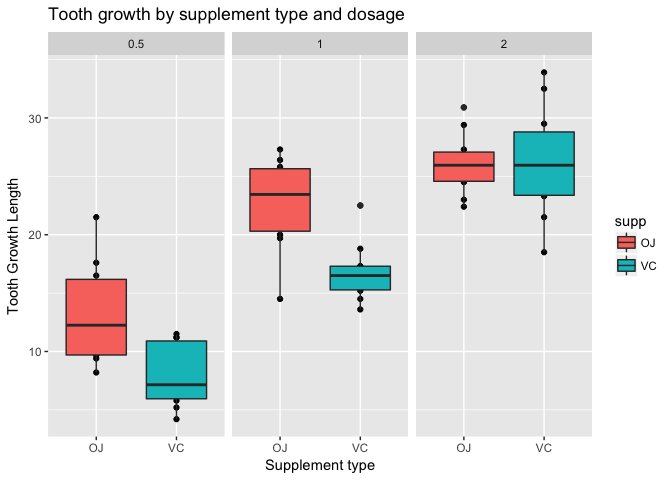

# Assignment 2: Inferential Data Analysis
Pallavi Gadgil  
7/1/2017  


## Inferential Data Analysis

This report contains Inferential Data Analysis of the ToothGrowth Data in the R datasets package. The objective for this assignment is to 

  >1. Load the ToothGrowth data and perform some basic exploratory data analyses
  >2. Provide a basic summary of the data.
  >3. Use confidence intervals and/or hypothesis tests to compare tooth growth by supp and dose. (Only use the techniques from class, even if there's other approaches worth considering)
  >4. State your conclusions and the assumptions needed for your conclusions.


## Load the ToothGrowth data and perform some basic exploratory data analyses
The ToothGrowth data is loaded from the datasets package. Per R documentation, the data represent "The Effect of Vitamin C on Tooth Growth in Guinea Pigs".


```r
data(ToothGrowth)
head(ToothGrowth)
```

```
##    len supp dose
## 1  4.2   VC  0.5
## 2 11.5   VC  0.5
## 3  7.3   VC  0.5
## 4  5.8   VC  0.5
## 5  6.4   VC  0.5
## 6 10.0   VC  0.5
```

## Provide Basic Summary of the Data


```r
str(ToothGrowth)
```

```
## 'data.frame':	60 obs. of  3 variables:
##  $ len : num  4.2 11.5 7.3 5.8 6.4 10 11.2 11.2 5.2 7 ...
##  $ supp: Factor w/ 2 levels "OJ","VC": 2 2 2 2 2 2 2 2 2 2 ...
##  $ dose: num  0.5 0.5 0.5 0.5 0.5 0.5 0.5 0.5 0.5 0.5 ...
```

```r
summary(ToothGrowth)
```

```
##       len        supp         dose      
##  Min.   : 4.20   OJ:30   Min.   :0.500  
##  1st Qu.:13.07   VC:30   1st Qu.:0.500  
##  Median :19.25           Median :1.000  
##  Mean   :18.81           Mean   :1.167  
##  3rd Qu.:25.27           3rd Qu.:2.000  
##  Max.   :33.90           Max.   :2.000
```

As seen in the suumary of this dataset, it has 60 observations on 3 variables.

  >* [,1]	len	numeric	Tooth length
  >* [,2]	supp	factor	Supplement type (VC or OJ).
  >* [,3]	dose	numeric	Dose in milligrams/day

To look at this data further, a box plot is prepared to look at the Tooth growth by Supplement Type and the dosage.

```r
qplot(supp, len, data = ToothGrowth, 
      facets = ~dose, 
      main = "Tooth growth by supplement type and dosage", 
      xlab = "Supplement type", 
      ylab = "Tooth Growth Length") + 
  geom_boxplot(aes(fill = supp))
```

<!-- -->


Based on the plot, it looks like the doage may have an impact on the Tooth growth but not quite clear if summplement type has any impact.


##  Use confidence intervals and/or hypothesis tests to compare tooth growth by supp and dose.

Lets start with the null hypothesis that supplement type does not have any impact on the tooth growth rate.

```r
t.test(len~supp, paired=FALSE,data=ToothGrowth,var.equal=TRUE)
```

```
## 
## 	Two Sample t-test
## 
## data:  len by supp
## t = 1.9153, df = 58, p-value = 0.06039
## alternative hypothesis: true difference in means is not equal to 0
## 95 percent confidence interval:
##  -0.1670064  7.5670064
## sample estimates:
## mean in group OJ mean in group VC 
##         20.66333         16.96333
```
As we can see, the P value is > 0.05 and the 95% confidence interval includes 0. Hence there is not enough evidence to reject the null Hypothesis.

### Lets start comparing growth rate for dosage. 

Since the dosage has 3 unique values (0.5,1.0 and 2.0), we will split the data set in 2 dosage types to run the t tests. Each comparision set will have null hpothesis that the increase in the dosage does not increase the tooth growth length. 


#### Comparing dosage 0.5 and 1.0


```r
toothGrowth0510<- subset(ToothGrowth, dose %in% c(0.5,1.0))
t.test(len~dose, paired=FALSE,data=toothGrowth0510,var.equal=TRUE)
```

```
## 
## 	Two Sample t-test
## 
## data:  len by dose
## t = -6.4766, df = 38, p-value = 1.266e-07
## alternative hypothesis: true difference in means is not equal to 0
## 95 percent confidence interval:
##  -11.983748  -6.276252
## sample estimates:
## mean in group 0.5   mean in group 1 
##            10.605            19.735
```

#### Comparing dosage 0.5 and 2.0

```r
toothGrowth0520<- subset(ToothGrowth, dose %in% c(0.5,2.0))
t.test(len~dose, paired=FALSE,data=toothGrowth0520,var.equal=TRUE)
```

```
## 
## 	Two Sample t-test
## 
## data:  len by dose
## t = -11.799, df = 38, p-value = 2.838e-14
## alternative hypothesis: true difference in means is not equal to 0
## 95 percent confidence interval:
##  -18.15352 -12.83648
## sample estimates:
## mean in group 0.5   mean in group 2 
##            10.605            26.100
```

#### Comparing dosage 1.0 and 2.0

```r
toothGrowth1020<- subset(ToothGrowth, dose %in% c(1.0,2.0))
t.test(len~dose, paired=FALSE,data=toothGrowth1020,var.equal=TRUE)
```

```
## 
## 	Two Sample t-test
## 
## data:  len by dose
## t = -4.9005, df = 38, p-value = 1.811e-05
## alternative hypothesis: true difference in means is not equal to 0
## 95 percent confidence interval:
##  -8.994387 -3.735613
## sample estimates:
## mean in group 1 mean in group 2 
##          19.735          26.100
```

As we can see, all 3 tests have close to 0 p value and the confidence interval at 95% does not cross over 0. Hence we must reject the null hypothesis and accept the alternative,i.e.  Tooth Growth increases with an increasing dose.

## Conclusion
Based on the above t tests we can conclude that
>1.  Supplement type has no effect on tooth growth/length
>2. Tooth Growth increases with an increasing dose.


