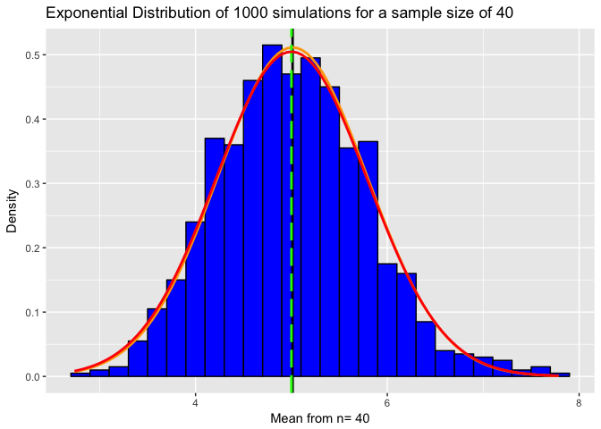
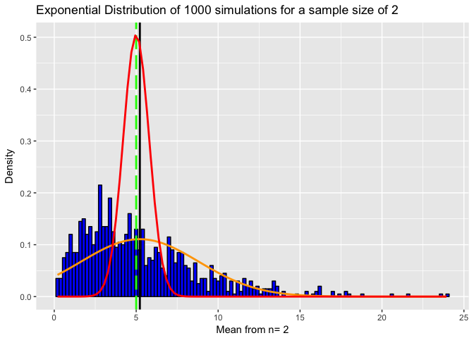
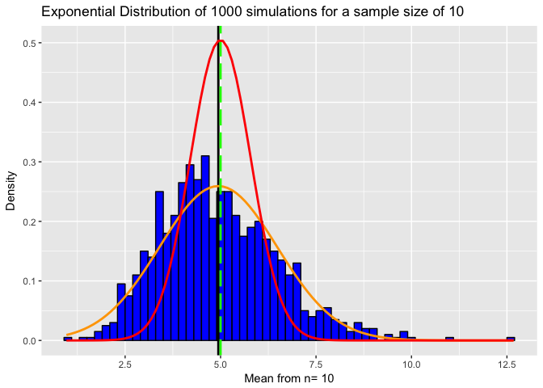

# Week4 Assignment1:Simulation Exercise
Pallavi Gadgil  
7/1/2017  


## Overview
This document contains investigation of the exponential distribution in R and comparision with the Central Limit Theorem.The mean of exponential distribution is 1/lambda and the standard deviation is also 1/lambda. Lambda is set to 0.2 for all of the simulations as per the instructions. 
The objective is to 

>1. Show the sample mean and compare it to the theoretical mean of the distribution.
>2. Show how variable the sample is (via variance) and compare it to the theoretical variance of the distribution.
>3. Show that the distribution is approximately normal.

### Simulations
The mean of exponential distribution is 1/lambda and the standard deviation is also 1/lambda. Simulations is set to 1000 and the sample size is set as 40. Theoritcal Exponential mean and standard deviations are also calculated.

```r
n<- 40
lambda <- 0.2
simulation <-1000
TheoreticalExpMean <- 1/lambda
TheoreticalExpSD <-1/lambda/1/sqrt(n)
TheoreticalVariance <- TheoreticalExpSD^2
```
simDataSet represents dataset collected with 1000 simulations of 40 sample sizes with the rate lambda. The data set is then processed to calculate the mean and sandard deviation for each row.


```r
simDataSet<-matrix(rexp(n*simulation,lambda),simulation)
simRowDataSet <-apply(simDataSet,1,mean)
simDataSetMean <- mean(simRowDataSet)
simDataSetSD <- sd(simRowDataSet)
simDataSetVariance <- simDataSetSD ^2
```

### Show the sample mean and compare it to the theoretical mean of the distribution. 

The sample mean is 5.0119113 and is very close to the theoretical mean of 5

### Show how variable the sample is (via variance) and compare it to the theoretical variance of the distribution.
The sample variance is 0.6088292 and is very close to the theoretical mean of 0.625

###Show that the distribution is approximately normal.
Following plot shows the histogram (in blue) of means of the exponential distrubtions. 
The vertical black line represents sample mean.
The orange curve represents the exponential distribution. 
The normal distribution is also plotted with the Theoretical mean and Standard deviations is and represented with the red line.
The green dotted line represents Theoretical mean of the normal distribution

```r
dfSim<-data.frame(simRowDataSet) # convert to data.frame for ggplot
mp<-ggplot(dfSim,aes(x=simRowDataSet))
mp<-mp+geom_histogram(binwidth = lambda,fill="blue",color="black",aes(y = ..density..))
mp<-mp + labs(title="Exponential Distribution of 1000 simulations for a sample size of 40", x="Mean from n= 40", y="Density")
mp<-mp + geom_vline(xintercept=simDataSetMean,size=1.0, color="black") # add a line for the actual mean
mp<-mp + stat_function(fun=dnorm,args=list(mean=simDataSetMean, sd=simDataSetSD),color = "orange", size = 1.0)
mp<-mp + geom_vline(xintercept=TheoreticalExpMean,size=1.0,color="green",linetype = "longdash")
mp<-mp + stat_function(fun=dnorm,args=list(mean=TheoreticalExpMean, sd=TheoreticalExpSD),color = "red", size = 1.0)
mp
```

<!-- -->

##Summary
The sample exponential distribution with sample size 40  is very close to normal and aligns with the centrl limit theorem. To additionally support this conclusion, I have caluclated sample mean and variance with the average of 2 and 10 exponentials. Following section presents plots for exponential averages 2 and 10. 

<!-- -->

<!-- -->

####
The plots clearly show that the exponential distrbitions for sample size 2 is not normal but with sample size 10 it is trending closer to normal. With sample size 40, the distribution looks normal.
